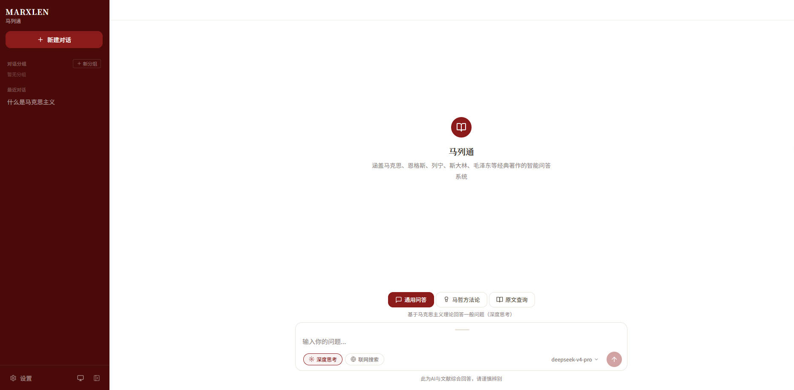
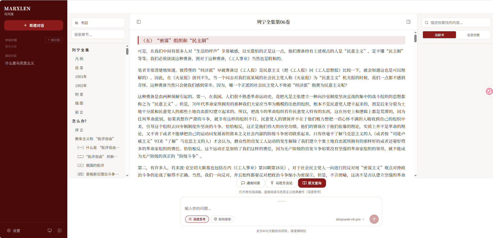
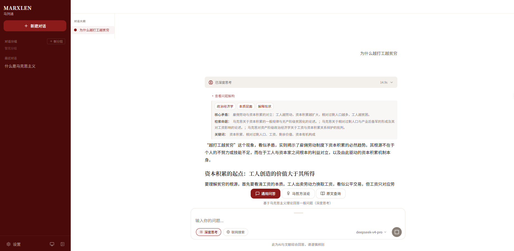

<p align="center">
  <h1 align="center">MarxLen · 马列通</h1>
  <p align="center">基于检索增强生成（RAG）的马列经典著作智能问答系统</p>
</p>

## 这是什么

MarxLen（马列通）让你用自然语言向马列经典著作提问。系统先从《马克思恩格斯全集》《列宁全集》《毛泽东选集》《斯大林全集》等原文中检索相关段落，再交由大语言模型作答，每条回答都附带可追溯的原文出处。

与直接问通用大模型的区别在于：**回答有据可查**。来源卡片会指明具体是哪部著作的哪一章节，双击即可跳转到原文阅读器对应位置。

## 免责声明

本系统的所有回答均由 AI 模型基于自身数据与检索到的文献自动生成，仅供参考，不代表作者的立场与意识形态。作者本人坚决拥护中国共产党的领导，坚持社会主义道路。

## 功能一览

| 功能 | 状态 | 说明 |
|------|------|------|
| 通用问答 | 可用 | 全量著作检索 + LLM 生成，附来源引用 |
| 原文阅读器 | 可用 | 连续阅读原文，支持目录跳转、模糊搜索、来源定位 |
| 深度思考 | 可用 | 使用推理模型，展示完整思考过程 |
| 检索过程可视化 | 可用 | 实时展示问题解构、检索、重排各阶段进度 |
| 对话消息树 | 可用 | 修改提问或重新生成不会丢弃旧回答，可用箭头切换版本 |
| 马哲方法论模式 | 开发中 | 运用唯物辩证法方法论分析现实问题 |
| **联网搜索** | **开发中，暂未启用** | 界面上的开关目前不会生效，请勿依赖 |





## 部署前必读：两个仓库的关系

本项目的数据分成两块，**分别存放在两个仓库**，请按需取用：

| 内容 | 位置 | 体积 | 什么时候需要 |
|------|------|------|--------------|
| 代码 + 预构建索引 | 本仓库，索引从本仓库的 [Releases](https://github.com/PrismScopes/MarxLen/releases) 下载 | 约 1.2 GB | 必需 |
| 原文 Markdown 语料 | [marxist-classics-markdown](https://github.com/PrismScopes/marxist-classics-markdown) | 约 152 MB | 想用**原文阅读器**时必需 |

为什么要拆开？索引是二进制产物、语料是纯文本，两者更新节奏不同；而且不少人只想问答、不需要翻原文，拆开可以少下 152 MB。

**只想问答**：只部署本仓库即可，检索和回答都能正常工作（原文片段已存在索引里）。

**还想读原文 / 用来源跳转**：需要额外把语料仓库放到 `ww/` 目录，见下文第三步。

## 快速开始

### Windows：一键安装（推荐）

面向完全不懂技术的用户，全程双击即可，不需要 git、不需要 clone、不需要会 GitHub：

1. 打开本仓库的 [Releases](https://github.com/PrismScopes/MarxLen/releases) 页面，下载 **MarxLen.exe**（约 178 KB）
2. 把 exe 放到你打算安装的文件夹（例如 `D:\MarxLen`），双击它
   - exe 放在哪个文件夹，就装到哪个文件夹；放在空文件夹里它会**自动下载项目代码**，无需手动 clone
3. 选择「1 安装」，程序会自动：
   - 检查电脑环境（系统版本、CPU 架构、磁盘空间、网络连通性）
   - 下载内嵌 Python 到安装目录（不污染系统，卸载就是删文件夹）
   - 安装全部依赖
   - 弹出记事本让你填写 API 密钥（两个，见下文申请地址）
   - 从 Releases 下载知识库（1.2 GB，支持断点续传）
   - 询问是否下载原文语料（152 MB，可选）
4. 装完后再次双击 exe 选「2 启动」，稍等 30 秒到 2 分钟，浏览器自动打开 http://localhost:8000
5. 用完选「3 关闭」

安装中途可以随时关闭窗口，重新双击会从断点继续，不会重下已下载的部分。

### 手动部署（Linux / macOS 或进阶用户）

#### 1. 克隆仓库

```bash
git clone https://github.com/PrismScopes/MarxLen.git
cd MarxLen
```

从 [Releases](https://github.com/PrismScopes/MarxLen/releases) 下载三个索引文件放入 `rag/` 目录：

```bash
# 以 data-v1 为例
mkdir -p rag
curl -L -o rag/documents.db  https://github.com/PrismScopes/MarxLen/releases/download/data-v1/documents.db
curl -L -o rag/faiss_index.idx https://github.com/PrismScopes/MarxLen/releases/download/data-v1/faiss_index.idx
curl -L -o rag/bm25_index.pkl https://github.com/PrismScopes/MarxLen/releases/download/data-v1/bm25_index.pkl
```

确认文件是真实大小而不是几百字节的占位文件：

```bash
ls -lh rag/faiss_index.idx    # 应约 637 MB
```

#### 2. 配置 API Key

```bash
cp rag/.env.example rag/.env
```

编辑 `rag/.env`：

| 变量 | 用途 | 去哪申请 |
|------|------|----------|
| `OPENAI_API_KEY` | 生成回答 | 任意兼容 OpenAI 格式的服务，如 [DeepSeek](https://platform.deepseek.com/) |
| `EMBED_API_KEY` | 向量检索与重排序 | 任意兼容 OpenAI 格式的服务（如硅基流动） |

`OPENAI_API_BASE_URL` 与 `EMBED_API_BASE_URL` 也要改成对应服务商的地址。其余项留空即用默认值。

接口按 OpenAI 标准调用，所以不限于 DeepSeek——任何兼容该格式的服务（OpenAI、通义、Kimi、本地 vLLM 等）改掉 base_url 和模型 ID 就能用。

### 3. 下载原文语料（可选，但推荐）

不做这一步，问答一切正常，只是**原文阅读器打不开、来源卡片无法跳转**。

仓库里有一个空的 `ww/` 目录（内含 `ww/README.md` 说明），语料就放在这里：

```bash
git clone https://github.com/PrismScopes/marxist-classics-markdown.git ww-tmp
mv ww-tmp/*.md ww/
rm -rf ww-tmp
```

Windows PowerShell：

```powershell
git clone https://github.com/PrismScopes/marxist-classics-markdown.git ww-tmp
Move-Item ww-tmp\*.md ww\
Remove-Item -Recurse -Force ww-tmp
```

完成后目录形如：

```
MarxLen/
├── ww/
│   ├── 马克思恩格斯全集01上.md
│   ├── 列宁全集第01卷.md
│   └── ...
├── rag/
└── api/
```

想放到别处，可在设置页把 `reader_corpus_dir` 改成你的路径。

### 4. 启动

**Docker（推荐）**

```bash
# 首次启动前，先创建运行时数据库文件（空文件即可，SQLite 会自动建表）
touch rag/cache_embeddings.db rag/cache_answers.db api/conversations.db
# Windows PowerShell:
# New-Item -ItemType File rag/cache_embeddings.db,rag/cache_answers.db,api/conversations.db

docker compose up -d
```

**不用 Docker**

```bash
cd rag && uv sync && cd ..

# Linux / macOS
rag/.venv/bin/python -m api.main
# Windows
rag/.venv/Scripts/python -m api.main
```

打开 http://localhost:8000

## 主要功能

界面顶部有三个模式标签，切换后提问方式和结果呈现都不同。

### 通用问答

默认模式，适合「XX 是什么」「XX 和 XX 的区别」这类知识性提问。

提问后系统按这个顺序工作：先把你的问题解构成若干检索意图（避免口语化提问检索不到内容），然后同时走**向量检索**（按语义找相近段落）和 **BM25 关键词检索**（按词面精确匹配），两路结果用 RRF 融合，再交给重排序模型按相关度精排，最后把选中的原文段落连同你的问题一起交给大模型作答。

这几个阶段在界面上实时可见，不会让你干等；你能看到系统究竟解构出了什么、检索到了哪些内容，回答不合预期时可以判断是检索没找对还是模型没答好。

回答下方会列出本次实际引用的文献，**双击来源卡片**即可打开原文阅读器并定位到对应段落——定位依据是原文的空白归一化匹配，实测命中率 99.5%，极少数定位不到时会退回到章节开头。这是本项目和直接问通用大模型最主要的区别：**每句话都能翻回原文核对**。

配套能力：
- **深度思考**：切换为推理模型，可展开查看完整推理链，思考过程由 API 单独返回，不混进正文
- **对话消息树**：改提问或重新生成时旧回答不会被丢弃，消息上方出现 `< 2/2 >` 切换器，随时翻回之前的版本，且所有分支都在同一个对话内

### 马哲方法论

<!-- 待补充：这一模式的定位与实际效果由作者填写 -->

> 当前后端尚未针对该模式做差异化处理，界面标签已就位但走的仍是通用问答流程。

### 原文查询

不生成回答，直接读原文。

左侧栏进入阅读器后可以按书籍浏览、用左侧目录跳转章节，也可以在书内做**模糊搜索**——输入大意即可，不必是原文原句（这一步会调用模型把你的描述转成经典文献里真实出现过的术语再检索）。从问答的来源卡片也能直接跳进来。

阅读器读的是 `ww/` 下的 Markdown 原文而非索引，所以**你在运行期间直接编辑原文文件，刷新页面就能看到改动**，无需重启服务。读到有价值的段落时，划中它点一下，就能带着这段原文切回通用问答或马哲方法论继续提问。

> 本模式需要下载原文语料，见「部署前必读」。不下载不影响问答，只是阅读器打不开、来源卡片无法跳转。

### 联网搜索（暂未启用）

界面上有联网搜索开关，但**该功能仍在开发中，尚未接入正式流程，打开也不会生效**。请不要依赖它，后续版本会正式启用。

## 配置

大部分参数在设置页面直接改，即时生效，会写入根目录 `config.json`（该文件不入库，属于你的本地状态）。

需要写在 `rag/.env` 里的只有以下几项：

| 变量 | 默认值 | 说明 |
|------|--------|------|
| `OPENAI_API_BASE_URL` | `https://api.deepseek.com/v1` | 生成模型服务地址 |
| `OPENAI_API_KEY` | — | 生成模型密钥 |
| `OPENAI_MODEL` | `deepseek-chat` | 默认模型 ID |
| `OPENAI_MODEL_LIST` | — | 设置页下拉可选模型，格式 `id1:显示名1,id2:显示名2` |
| `EMBED_API_BASE_URL` | — | embedding / rerank 服务地址 |
| `EMBED_API_KEY` | — | embedding / rerank 密钥 |
| `EMBED_MODEL` | `Qwen/Qwen3-Embedding-0.6B` | 向量模型，**不要改** |
| `RERANK_MODEL` | `Qwen/Qwen3-Reranker-4B` | 重排序模型，可换 |
| `CORS_ALLOW_ORIGINS` | 本地两个地址 | 前端独立部署到别的域名时才需要配 |

`EMBED_MODEL` 必须保持默认值。仓库提供的索引是用这个模型生成的，换成别的模型后向量维度与语义空间都不一致，检索结果会完全错乱。你的 embedding 服务商需要支持该模型。

从旧版本升级：原来的 `DEEPSEEK_API_KEY` / `DEEPSEEK_MODEL` 等变量名仍然可用，程序会自动回退读取，不必改动现有 `.env`。新名与旧名同时存在时以新名为准。

## 提示词自定义

`Prompt/` 下两份提示词可直接编辑，重启服务生效：

- `main_prompt.txt` — AI 的思考方法与输出规范。「输入数据契约」章节声明它从检索模块接收哪些字段；「输出要求」章节的引用格式被前端依赖，改动需谨慎。
- `RAG_prompt.txt` — 检索前的问题解构流程。末尾的 JSON 输出格式由程序解析，字段名不能改。

文件缺失时会回退到内置精简提示词，服务不会崩，但检索质量会下降。

## 关于索引

索引以预构建形式从本仓库的 [Releases](https://github.com/PrismScopes/MarxLen/releases) 分发，开箱即用，无需自己跑向量化：

- `rag/documents.db` — 文档库，约 282 MB
- `rag/faiss_index.idx` — 向量索引，约 637 MB
- `rag/bm25_index.pkl` — 关键词索引，约 246 MB

三者是配套的：`documents.db` 的主键即 FAISS 的向量 ID，BM25 也按同一顺序对齐，**不要单独替换其中任何一个**，否则来源会整体错位。

建库与向量化脚本不随仓库分发。

索引文件不进代码仓库（过大），Windows 用户由 MarxLen.exe 安装时自动下载，Linux / macOS 用户见「快速开始」手动部署。

## 项目结构

```
api/                后端服务（FastAPI + SSE 流式接口）
  reader.py         原文阅读器与模糊搜索
  conversation_store.py  对话消息树存储
rag/                检索与问答引擎
  retriever.py      混合检索（向量 + BM25 并行，RRF 融合）
  generator.py      回答生成与流式输出
  query_planner.py  问题解构与检索计划
deploy/             部署脚本源码（不随仓库分发，打包为 MarxLen.exe 经 Releases 提供）
Prompt/             提示词（可独立编辑，改动无需改代码）
marxist-rag-ui/     前端页面
tests/              测试
ww/                 原文语料（需另行下载，不在本仓库）
```

## 技术实现

检索采用向量与关键词双通道并行，再用 RRF 融合、重排序模型精排：

- 向量检索：FAISS `IndexIDMap`，向量 ID 直接对应 SQLite 主键
- 关键词检索：BM25 + jieba 分词
- 两路检索并行执行，融合顺序固定以保证结果可复现
- 嵌入与回答均有缓存

## 测试

```bash
# 纯逻辑测试，秒级完成，不消耗 API 额度
rag/.venv/Scripts/python tests/test_unit.py
rag/.venv/Scripts/python tests/test_cache.py
rag/.venv/Scripts/python tests/test_config.py

# 需要真实 API，耗时较长
rag/.venv/Scripts/python tests/test_integration.py
rag/.venv/Scripts/python tests/test_api.py
rag/.venv/Scripts/python tests/test_degrade.py
```

## 常见问题

**索引文件只有几百字节？**
说明下载到的是占位文件而非真实数据。Windows 用户重新运行 exe 选「1 安装」会自动校验并重新下载；手动部署的用户重新执行 `curl` 下载命令。

**阅读器提示原文目录不存在？**
没有下载语料仓库，见「快速开始」第三步。Docker 部署还需确认 `ww` 已挂载进容器。

**启动很慢？**
需加载 637 MB 的 FAISS 索引和 245 MB 的 BM25 索引，首次启动约一分半属正常。

**回答里的来源点了没反应？**
需要双击。若仍无反应，多半是没下载语料。

**一键安装报错，看不懂怎么办？**
程序会给出具体可执行的解决方案，并记录完整日志在安装文件夹的 `deploy\install.log`（安装）和 `deploy\start.log`（启动）。仍解决不了就把这个文件发给作者。

## License

MIT

语料版权归原出版方所有，仅供学习研究使用。
